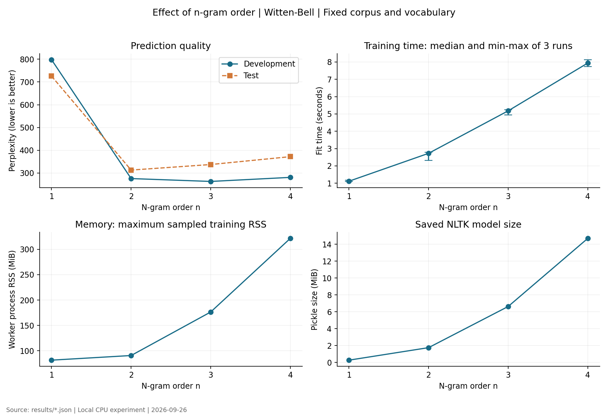
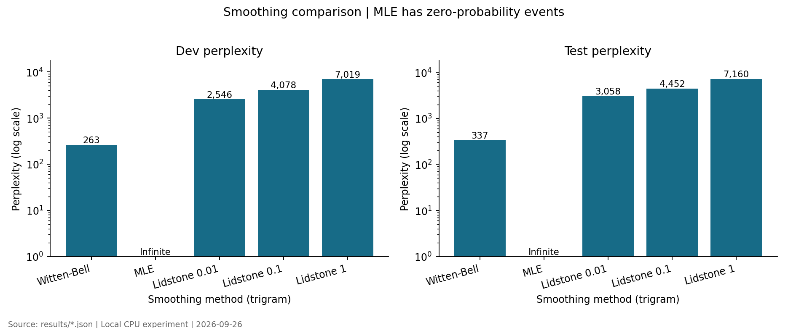
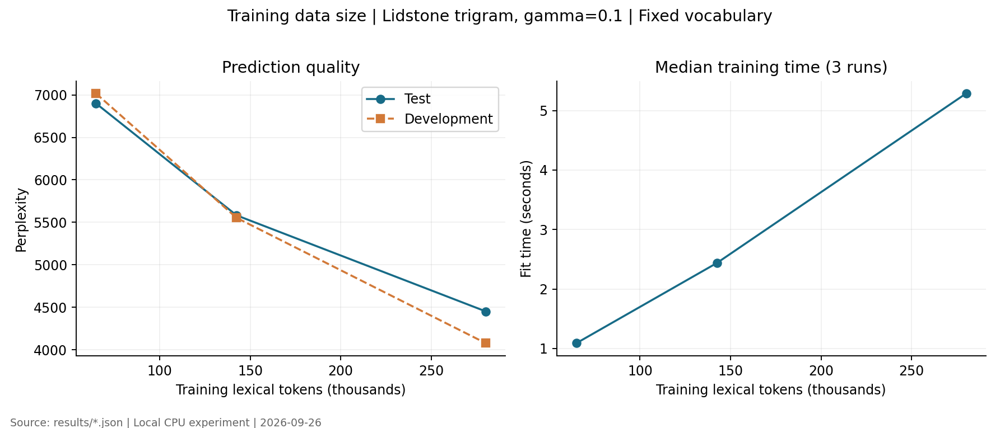
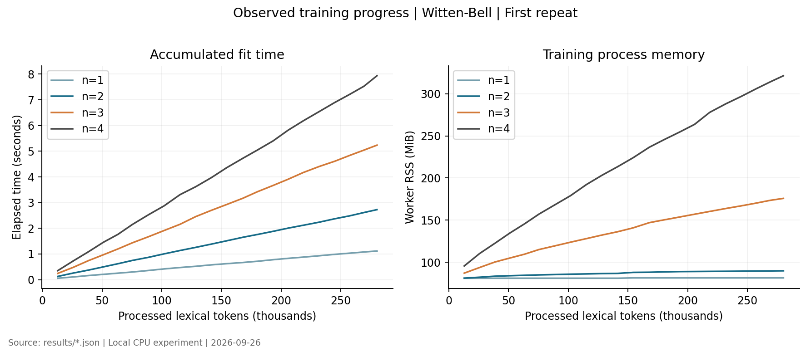
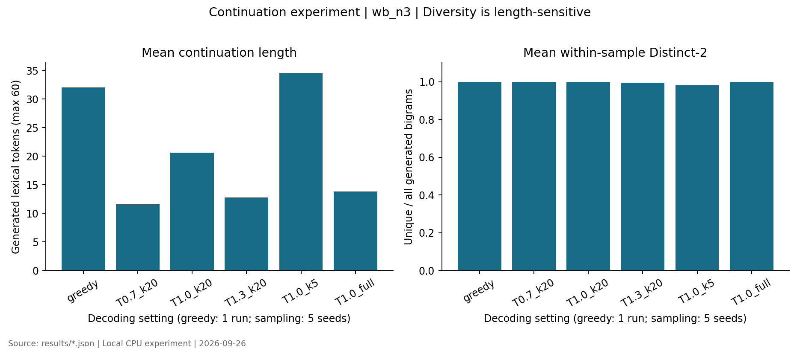

> 历史归档：这是此前 NLTK 版本的记录；当前已完成 KenLM 实验，请阅读项目根目录的 [README](../../README.md) 和 [实验报告](../../实验报告.md)。

# 人民日报中文词级 n-gram 语言模型实验报告

> 本报告由 `python -m ngram_lab.cli report` 根据本机真实结果生成。结果日期：2026-09-26。未使用 GPU，未调用大语言模型生成实验续写，未伪造训练耗时。使用 NLTK，不声称已运行 SRILM 或 KenLM。

## 一、实验目的

1. 理解分词语料、n-gram 计数和条件概率之间的关系，能手算并核对模型概率。
2. 理解为何自然语言建模必须清除词性、实体和编号等任务外标签。
3. 在同一语料和词表下比较阶数与平滑，在固定词表下比较训练数据量。
4. 测量训练时间、内存和模型大小，观察实际计数过程。
5. 比较温度、top-k 和贪心解码，并认识局部流畅与全局连贯的区别。

## 二、实验原理

### 2.1 马尔可夫假设与最大似然

$$P(w_1,\ldots,w_m)\approx\prod_{t=1}^m P(w_t\mid w_{t-n+1},\ldots,w_{t-1})$$

模型只保留最近 n−1 个词的上下文。对于上下文 h，最大似然为 $P(w\mid h)=C(h,w)/C(h)$。例如，训练语句“我 爱 你”“我 爱 他”“他 爱 你”中，二元概率 $P(你\mid 爱)=2/3$。无平滑 MLE 遇到从未出现的组合时概率为零，进而使整段文本概率为零。

训练是计数和概率估计；本项目没有学习率、epoch、反向传播或损失下降曲线。不同阶数训练的是不同模型，不是同一模型的不同训练轮次。

### 2.2 平滑方法

Lidstone 加性平滑：$P(w\mid h)=(C(h,w)+\gamma)/(C(h)+\gamma|V|)$，比较 γ=0.01、0.1、1。γ=1 即加一平滑。它能消除零概率，但在较大词表和稀疏上下文中可能分配过多概率给不合理的候选词。

Witten–Bell 插值：若上下文后总计数为 N(h)，不同后继类型数为 T(h)，则

$$P_{WB}(w\mid h)=\frac{C(h,w)}{N(h)+T(h)}+\frac{T(h)}{N(h)+T(h)}P_{WB}(w\mid h')$$

h′ 去掉最早的一个上下文词；上下文未见时退到较短上下文。本实现使用 NLTK 的一元 MLE 作为递归基础。因此 WB 不是“对任何词都自动给非零概率”：需要训练中有实际 UNK 计数。本实验把训练集中仅出现一次的词映射为 UNK。

实现基于 [NLTK 官方语言模型接口](https://www.nltk.org/api/nltk.lm.html)及其 [Witten–Bell 源码](https://www.nltk.org/_modules/nltk/lm/smoothing.html)。生成时使用等价向量运算加速，单词概率已经由测试与 NLTK 原始 `score` 逐项核对。

### 2.3 评测与采样

$$H=-\frac{1}{N}\sum_t\ln P(w_t\mid h_t),\qquad PPL=\exp(H)$$

N 为所有测试正文词加每句一次 EOS 的预测事件数，不计 BOS。先汇总所有事件的负对数概率再除以 N，不对各句困惑度取算术平均。零概率使 PPL=∞；JSON 中保存 `null` 和 `ppl_infinite=true`，不把零概率偷换成任意小数。

生成时使用 $P_T(w\mid h)\propto P(w\mid h)^{1/T}$，然后进行 top-k 截断和重新归一化。T 小使分布更集中，T 大使分布更平坦；top-k=0 表示全词表。禁用 BOS 和 UNK，EOS 仍可被采样。评测使用原始模型概率，不使用温度或 top-k 调整后的概率。

## 三、实验配置

- 主机：Intel Core Ultra 5 235HX；检测到 14 个物理核、14 个逻辑处理器，内存 31.36 GiB。
- 系统：Windows-10-10.0.26200-SP0；Python 3.11.16；Conda 环境 `ngram-lab`。
- 主要依赖：NLTK 3.9.2、NumPy 2.2.6、Matplotlib 3.10.3、psutil 7.0.0。
- RTX 5060 8GB 不参与本实验；稀疏计数与查表适合 CPU，本项目没有 GPU 框架依赖。
- 串行训练，每个训练进程预算 4096 MiB、600 秒；不同时运行多个训练任务。
- 主语料预算 350,000 正文词；采样/划分种子 20260926。

工具选择：课程提及 SRILM、KenLM。检查时本机只有 Docker Desktop 的 WSL 发行版，Docker 后端未能提供可用服务；Conda 的 KenLM 包检查到的是 Linux 构建。本项目选用原生 Windows 上可直接调试的 NLTK 完成全部实验，避免把课程实验变成系统配置工程。这不是性能优劣结论。KenLM 使用 modified Kneser–Ney，与本次 WB/加性平滑不同，不能拿本报告耗时当作两工具基准。[KenLM 官方说明](https://github.com/kpu/kenlm)、[训练与内存参数](https://kheafield.com/code/kenlm/estimation/)。

## 四、实验设计

### 4.1 数据来源、清洗与划分

使用 Yueqing Sun 于 2018-01-11 上传的 [Figshare 人民日报语料](https://doi.org/10.6084/m9.figshare.5777397.v1)。下载文件 ID 为 10193073，大小 8,830,154 字节，页面元数据标注 CC BY 4.0；这是第三方托管版本，不冒称老师微信群中的同一文件。原语料背景可参考[北京大学现代汉语多级加工语料库](https://opendata.pku.edu.cn/dataset.xhtml?persistentId=doi%3A10.18170%2FDVN%2FSEYRX5)。原始文件和处理后的全文默认不提交 GitHub，仅提交来源、校验、代码、统计和少量生成示例。

SHA256：`1e2574641b92bc07c61af95162ce3c62bdef5a5da04ceff0d50144b4aae4b6a1`。

实际检查：日期 19980101—19980131；3,148 篇文章，19,484 个非空原始行，去编号后有 1,121,447 个正文词条。按 GB18030 严格解码，解码失败或未知标注格式均报错。

自造清洗示例（不用于模型训练）：

```text
输入：19980101-01-001-001/m [北京/ns 大学/n]nt 召开/v 会议/n 。/w
输出：北京 大学 召开 会议 。
```

必须清理标签，因为“大学/n”和“大学”会成为不同词；实体括号、词性和文章编号还会污染计数或生成结果。清洗删除 POS 后缀、实体包装和行首编号，保留原来的词语边界与正文标点，不合并机构名和姓名；仅统一全角数字、英文字母。真实正文中的斜杠、方括号不一概删除。句末标点分句，末尾引号保留在前句；标题或段落残余也作为独立片段。

清洗识别 9,238 个实体起始包装，按确定顺序移除 746 条精确重复句子。先去重，再按完整文章随机抽样至 349,998 词、989 篇；预算不足时跳过整篇，不切断文章。抽样后重新洗牌，按文章数近似 80/10/10 划分，因此词数比例不是严格 80/10/10。

| 集合 | 文章数 | 句子/片段数 | 正文词数 | 映射为 UNK | 原始 OOV |
| --- | --- | --- | --- | --- | --- |
| train | 791 | 10930 | 280,200 | 4.46% | 0.00% |
| dev | 98 | 1339 | 33,929 | 8.54% | 6.10% |
| test | 100 | 1431 | 35,869 | 10.60% | 7.59% |

词表只由完整训练集建立，保留频次≥2 的 12,881 个正文词，另外包括 BOS、EOS、UNK。表中“原始 OOV”表示完整训练集从未出现过的词；“映射为 UNK”还包含训练中出现过但被低频阈值排除的词，两者不能混为一谈。

### 4.2 对照组与计时口径

1. **阶数组**：WB 的 n=1、2、3、4，其他设置相同。一元 WB 的概率基础就是一元 MLE。
2. **平滑组**：n=3，比较 MLE、Lidstone γ=0.01/0.1/1、WB。
3. **规模组**：Lidstone n=3、γ=0.1，使用相同随机文章顺序前 25%、50%、100%。共用完整训练集词表，验证/测试数据固定。选加性平滑是为了让小子集中没出现的固定词表词仍有非零概率；词表由最大训练池提供，应把此实验理解为“固定表示下增加计数数据”。
4. **生成组**：在验证集选出的 WB 模型上比较贪心、T=0.7/1/1.3（k=20）、k=5/20/全词表（T=1）；另做 n=1..4 的同参数生成对比。每种随机设置使用种子 11、22、33、44、55；贪心只运行一次；最多续写 60 词，遇 EOS 提前结束。

去除重复配置后共 10 个模型，每个训练三次，共 30 次。配置和重复顺序固定随机打乱；每次独立进程串行执行。计时包含流式 n-gram 构造、计数及进度采样，不含模块导入、语料读取、模型保存与评测。NLTK 的平滑概率主要在查询时计算，因此同阶不同平滑的 fit 时间并不代表各自完整查询成本。

训练内存以 psutil 每 20ms 抽样的进程 RSS 为准，报告三次最大值，包含 Python、依赖、已读入数据和计数；它不是 GPU 显存、全系统内存或严格的操作系统峰值。时间误差条是三次最小—最大值，不能当作置信区间。

先按验证 PPL 选模型并保存 `selection.json`，然后评测一次测试集；本报告展示预先定义的所有组别，但不据测试成绩再调整参数。

## 五、实验流程

```powershell
conda activate ngram-lab
cd E:\ngram
python -m ngram_lab.cli prepare
python -m pytest -q
python -m ngram_lab.cli experiment
python -m ngram_lab.cli generations
python -m ngram_lab.cli report
```

首次在其他机器上复现先执行 `conda env create -f environment.yml`。也可执行 `python -m ngram_lab.cli all` 重建整套实验。源文件 SHA256、划分文件 SHA256、文章清单、完整配置、依赖版本和执行顺序均保存在 `results/`；详细计数进度见 `results/logs/` 和 `results/runs/`。

训练在每句左侧放 n−1 个 BOS，末尾只放一个 EOS。每个正文词和 EOS 各贡献 1..n 阶计数；BOS 只作为上下文，不作为训练目标。评测也按同样的预测事件定义进行。Lidstone 的词表含 BOS，因而会给 BOS 少量平滑概率；生成时将其屏蔽再归一化，PPL 则保留工具本来的概率定义。

## 六、结果分析

### 6.1 汇总

| 配置 | 训练词数 | 训练中位数 s | 最小—最大 s | 峰值 RSS MiB | 模型 MiB | Dev PPL | Test PPL |
| --- | --- | --- | --- | --- | --- | --- | --- |
| wb_n1 | 280,200 | 1.12 | 1.10—1.17 | 81.5 | 0.28 | 797.87 | 725.58 |
| wb_n2 | 280,200 | 2.73 | 2.32—2.78 | 90.6 | 1.76 | 275.82 | 313.12 |
| wb_n3 | 280,200 | 5.18 | 4.95—5.24 | 176.4 | 6.63 | 263.21 | 337.49 |
| wb_n4 | 280,200 | 7.94 | 7.74—8.13 | 321.6 | 14.69 | 281.06 | 372.00 |
| mle_n3 | 280,200 | 5.02 | 4.62—5.15 | 176.5 | 6.63 | ∞ | ∞ |
| lid_n3_g0.01 | 280,200 | 5.29 | 5.27—5.50 | 176.2 | 6.63 | 2,546.31 | 3,057.58 |
| lid_n3_g0.1 | 280,200 | 5.29 | 3.49—5.39 | 176.5 | 6.63 | 4,078.17 | 4,452.13 |
| lid_n3_g1 | 280,200 | 5.21 | 4.86—5.39 | 176.3 | 6.63 | 7,018.95 | 7,159.88 |
| lid_n3_g0.1_f0.25 | 64,809 | 1.09 | 1.08—1.12 | 91.8 | 2.08 | 7,016.98 | 6,899.85 |
| lid_n3_g0.1_f0.5 | 142,478 | 2.44 | 2.41—2.82 | 125.1 | 3.90 | 5,553.36 | 5,582.79 |

验证集选择的最佳完整训练集模型为 **wb_n3**，验证 PPL=263.21，测试 PPL=337.49；训练中位数 5.18 秒。全部 30 次训练、相应子进程开销、验证及测试评测的总墙钟时间为 191.8 秒；不包括下载、依赖安装、生成和作图。

### 6.2 阶数、速度和内存



| 阶数 n | 最高阶不同 n-gram 数 | 全部阶 n-gram 条目数 |
| --- | --- | --- |
| 1 | 12,883 | 12,883 |
| 2 | 134,348 | 147,231 |
| 3 | 229,685 | 376,916 |
| 4 | 261,231 | 638,147 |

WB 的一元测试 PPL 为 725.58，四元为 372.00；验证集最优阶数为 3。从一元到四元，训练时间由 1.12s 变为 7.94s，模型文件由 0.28 MiB 变为 14.69 MiB。更高阶意味着保存更多上下文，但本实验不支持“阶数无限提高就一定更好”的结论；未出现的长上下文仍需回退。

本次验证与测试排序不同：二元 WB 的测试 PPL=313.12，低于三元的 337.49，但验证集是三元更优。模型选择仍保持验证集冻结的结果。这提示单次划分下的排名不稳定，也可能受到文章主题、未知词比例和高阶稀疏性的影响；仅凭这次实验不能区分这些因素各自的贡献。应在后续独立实验中更换训练/验证划分或做文章级重采样，而不是在当前测试集上继续调参。



三元 MLE 在 37,300 个测试预测事件中有 26,652 个零概率事件，因此困惑度无穷大。这不是数值异常，而是最大似然对未见组合的直接结果。平滑使对照模型得到有限 PPL；加性平滑的候选空间很大，其结果不能仅用“消除了零概率”评价。选择 γ 应看验证集；不能因为 γ 更大就认为效果更好。

### 6.3 数据量和训练进度



规模组从 64,809 词增加到 280,200 词时，测试 PPL 从 6899.85 变为 4452.13，总体下降。这只描述本次固定词表、固定平滑的三个规模点，不等同于对所有语料、所有平滑方法的普遍保证。



图中记录每处理 500 个句子/片段的累计时间和 RSS。读者可以看到计数增加与内存增长，而不是神经网络损失曲线。短任务会受到缓存、后台负载和系统调度影响；本机三次重复不足以推断跨机器性能。

### 6.4 指定开头续写

固定分词：`在 阳光明媚 的 五月 ， 我们 学校 胜利 召开 了`。题目的省略号视为续写占位符，不送入模型。提示词中词表外词为：阳光明媚；展示时保留原始提示，模型内部映射为 UNK。被映射的较早提示词对 n≤4 的首个预测通常已不在最后 n−1 词窗口内。

以下解码比较使用 **wb_n3**。表中只统计生成部分，不把固定提示算作多样性。完整 41 条结果见 `results/generations.json` 和 `results/生成样例.md`；下面每组固定展示第一个种子，没有按好坏挑选。

| 设置 | 样本数 | 平均长度/词 | EOS 终止比例 | 平均 Distinct-2 |
| --- | --- | --- | --- | --- |
| greedy | 1 | 32.0 | 100% | 1.000 |
| T0.7_k20 | 5 | 11.6 | 100% | 1.000 |
| T1.0_k20 | 5 | 20.6 | 100% | 1.000 |
| T1.3_k20 | 5 | 12.8 | 100% | 0.994 |
| T1.0_k5 | 5 | 34.6 | 100% | 0.982 |
| T1.0_full | 5 | 13.8 | 100% | 1.000 |



**greedy，seed=11，续写 32 词，EOS=True**

> 在阳光明媚的五月，我们学校胜利召开了由自给农业向现代农业的基础上，以“三下乡”活动，在新的一年里，我们的国家，其主要任务。

**T0.7_k20，seed=11，续写 22 词，EOS=True**

> 在阳光明媚的五月，我们学校胜利召开了由市长任组长，劳动、认真总结基层民主政治建设的重要因素是通货膨胀率、利率等。

**T1.0_k20，seed=11，续写 48 词，EOS=True**

> 在阳光明媚的五月，我们学校胜利召开了由局长王三运等部门的支持、推动再就业情况，要突出的是为了尽快制定一部艺术作品可以给人们留下印象最为深刻的思想性和艺术性高度统一促进会举行座谈会，纪念建的旧制度。

**T1.3_k20，seed=11，续写 12 词，EOS=True**

> 在阳光明媚的五月，我们学校胜利召开了由局长李天心在一年里双拥模范走廊。

**T1.0_k5，seed=11，续写 50 词，EOS=True**

> 在阳光明媚的五月，我们学校胜利召开了由主要出口产品的资源，以适应国内外市场上的一年的实践经验来看面临着一些困难企业的改革与持续发展的需要，从根本上扭转超负荷的，是一种，确立加强基层民主建设。

**T1.0_full，seed=11，续写 2 词，EOS=True**

> 在阳光明媚的五月，我们学校胜利召开了人群。


贪心选择每一步最可能的词，可能提前停止或进入循环；随机采样让同一模型产生不同结果。调温度和 top-k 不需要重新训练，也不会改变本报告中的原始模型 PPL。较高 Distinct-2 只说明局部词组较少重复，不能证明语义更好；较短文本更容易达到 1，应结合长度看。EOS 导致实际长度不同，因此这里是描述性分析，不能把多样性差异全归因于温度。

可以直接观察样例是否出现语义跳跃、人物/主题变化以及新闻式表达。模型只知道最近 n−1 个词，即使开头提到学校，也无法持续记住这一主题。报告不伪造人工评分；没有多人标注的一致性数据，也没有唯一参考续写，因此不把 BLEU/ROUGE 作为主指标。

本次贪心样例从学校会议跳到了农业发展和“三下乡”，T=1、k=20 的首条样例又转向再就业和艺术作品；二元的首条样例甚至只续出“，为。”。这些具体失败说明局部转移概率不等于完整语义规划。温度升高后的平均长度也没有简单的单调规律，不能把少量样本归纳成“温度越高，文本一定越长或越好”。

### 6.5 追踪第一次预测，解释代码为什么这样输出

首个预测实际使用的上下文是 `召开 / 了`。它在训练中只有 2 次后继事件、2 种后继词。`results/prediction_trace.json` 保存了各级上下文的真实计数和候选概率。

| 候选词 | 原始模型条件概率 |
| --- | --- |
| 由 | 0.251520 |
| 国防 | 0.250134 |
| <UNK> | 0.025288 |
| ， | 0.025279 |
| 。 | 0.019507 |

本次三元上下文“召开 / 了”的两个后继分别是“由”和“国防”，各出现一次。因此 WB 对每个词的直接计数部分是 1/(2+2)=0.25，另加 0.5 倍的低阶概率。模型并不知道题目想要的是“会议”，它只是把有限训练样本中的转移计数转为概率。贪心选择“由”因此有明确的统计原因。表内概率尚未屏蔽 UNK、调温或截断；生成阶段的概率会再归一化。

## 七、结论

1. 清洗决定模型的基本学习单位。词性、实体包装和文章编号必须与正文分离；正文标点和合理的句子边界应保留。
2. 本实验验证了数据稀疏问题：无平滑三元模型得到无穷 PPL；平滑模型能为本次测试中的组合分配非零概率。
3. 验证集选中 wb_n3，在本次映射词表和测试集上 PPL 为 337.49。这一结果不应被描述成通用中文生成能力。
4. 普通 CPU 即可完成受控规模实验。本次单配置最大采样 RSS 为 321.6 MiB，低于 4096 MiB 预算；GPU 没有必要参与。
5. 温度和 top-k 控制采样分布，无法补足有限上下文和训练语料领域带来的限制。理解计数、回退和逐步采样，比只得到一段看似通顺的续写更重要。

## 八、不足与改进方向

- 数据是第三方托管的 1998 年 1 月新闻子集，未核对老师群文件；只有一次文章划分和抽样，不能代表现代中文或校园语言。
- 精确句子去重不能发现近重复、改写或同一事件的不同报道；可以增加跨集合近重复审计和按日期外推测试。
- UNK 合并降低了预测目标难度，且测试 UNK 比例不低；PPL 只适用于本次共同词表，不直接与不同分词、词表或字级模型比较。
- 保留语料细粒度切分，机构名、姓名可能被拆开；标题、署名、图片说明等仍作为文本片段，可能影响生成。
- WB 并非 modified Kneser–Ney。后续可在可用的 Linux/WSL 环境用 KenLM 复现相同语料，再清楚区分实现、算法和计时边界后比较。
- 仅三次计时、每种随机生成五个种子，没有置信区间和多人盲评；内存为采样近似值。
- NLTK 用 Python 对象保存稀疏计数，模型文件不是压缩 ARPA，不能把本实验文件大小直接与 KenLM 二进制模型对照。

## 附：代码认知检查

1. 在 `modeling.py:sentence_ngrams` 设断点，检查一句话产生哪些一元、二元、三元计数，为什么不能跨句拼接。
2. 手算 `tests/test_core.py` 的 $P(你\mid 爱)=2/3$，解释零概率如何产生无穷 PPL。
3. 在 `generation.py:Distribution.probabilities` 查看上下文未见时的回退，逐项与 `model.score` 核对。
4. 在 `generation.py:Distribution.sample` 比较调整前概率、温度变化、top-k 截断与归一化；说明它们为什么不属于训练。
5. 解释为何三次训练主要测量运行波动，而非三种随机模型：固定数据的计数估计是确定性的。

所有结果来自保留的日志与 JSON；修改配置后应重新运行实验再重建报告，不能只修改结论中的数字。
