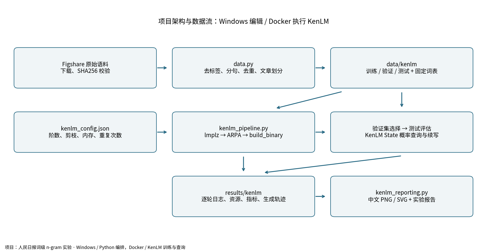
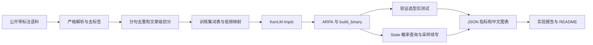
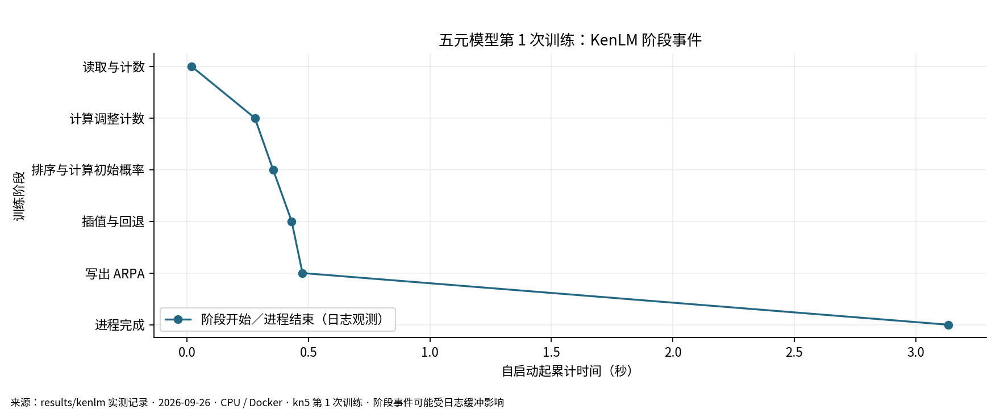
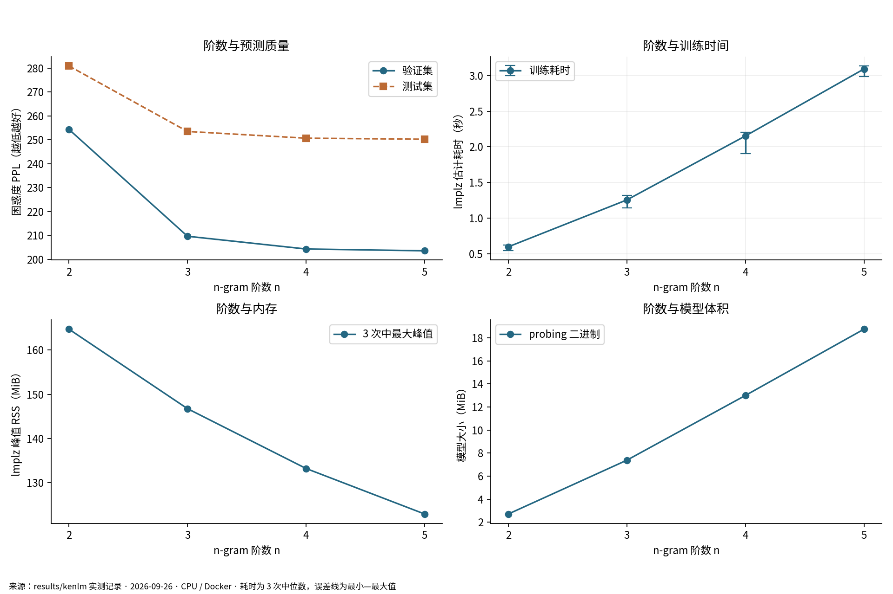
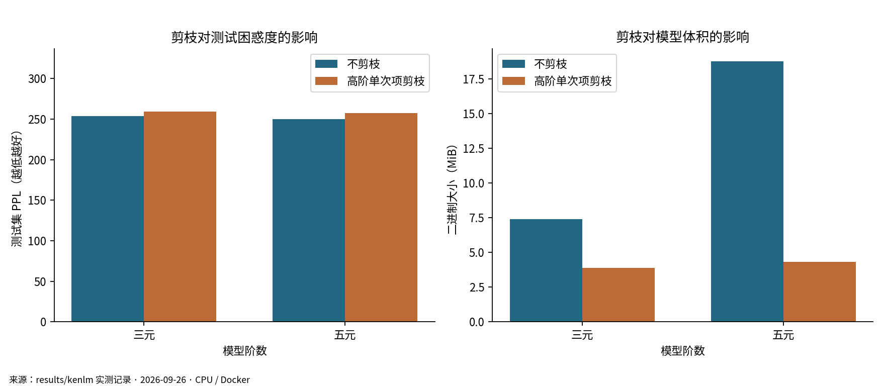
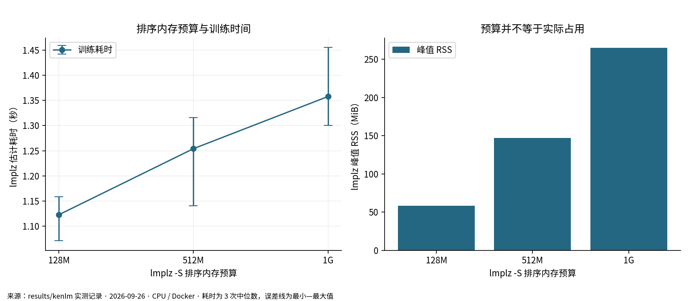
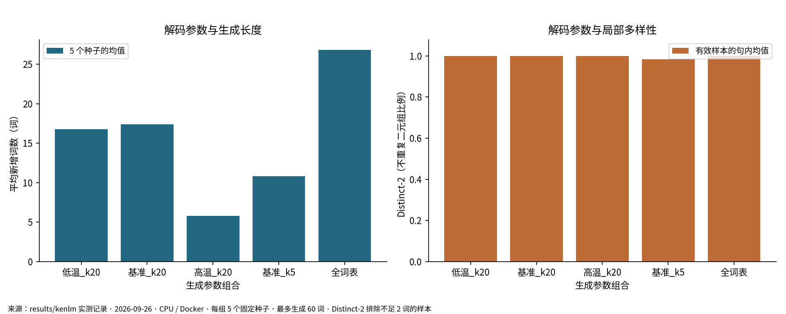

# 人民日报词级 n-gram 建模与文本续写实验报告（KenLM）

实验日期：2026-09-26。本文数字由真实日志和 JSON 自动生成；工具为 **KenLM lmplz + build_binary + Python 绑定**。

## 一、实验目的

1. 理解“从带标注文本到词序列，再到条件概率”的完整链条，解释为什么语言建模必须清理多余标签。
2. 在本机资源约束下实际训练 2–5 元模型，比较阶数、剪枝和排序内存预算对时间、内存、体积与困惑度的影响。
3. 用指定开头续写，改变温度、top-k 和随机种子，观察局部连贯性、重复与主题漂移。
4. 保存可复查的数据版本、划分、原始日志和生成轨迹，使结果可以重现，而不只是代码可以运行。

## 二、实验原理

### 2.1 n-gram 的条件独立近似

句子概率由链式法则展开，用最近 n−1 个词近似完整历史：

$$P(w_1,\ldots,w_T)\approx\prod_{t=1}^{T+1}P(w_t\mid w_{\max(1,t-n+1)},\ldots,w_{t-1}).$$

其中最后一个预测为句末 EOS。BOS 提供起始上下文，不计为被预测词。模型阶数更高意味着可利用更长的局部信息，但也增加稀疏性和存储量。词级五元只记住前四个词，无法像现代大语言模型那样持续保持全文主题。

### 2.2 Modified Kneser–Ney 平滑与回退

直接使用最大似然 `c(h,w)/c(h)` 会使未见过的组合概率为 0。KenLM 的 lmplz 使用插值 Modified Kneser–Ney：从已见组合的计数扣除折扣，将概率质量分配给较短历史；低阶分布使用不同左上下文的延续计数，而不是简单词频。直观表达为：

$$P_{KN}(w\mid h)=\frac{\max(c(h,w)-D(c(h,w)),0)}{c(h)}+\lambda(h)P_{KN}(w\mid h').$$

这是便于理解的递归形式；实现中低阶使用调整计数，折扣通常按计数为 1、2、≥3 分别估计。所有模型共用该平滑方法，本实验不把 `-S` 当成平滑参数。`--discount_fallback` 只在折扣无法估计时提供后备值，并不是默认替换正常估计。日志检查结果：本次所有正式配置均未检测到折扣回退警告。

`--prune 0 0 1` 删除三元及以上原始计数不大于 1 的项目；第一个 0 保留所有一元项。五元实验显式写为 `0 0 1 1 1`。KenLM 的这项剪枝依据原始计数，不是概率阈值。ARPA 保存 log10 概率及回退权重，`build_binary probing` 编译为便于查询的二进制。

### 2.3 为什么这次必须清除 tag 和标签

当前目标是预测自然语言的下一个词，而不是预测词性或命名实体。若把 `学校/n` 当词，会使相同表面词因标签不同被拆成多个词型；若将 `/n`、`]nt` 单独保留，模型会学习标注规律；文章编号也会污染词表。最终可能生成编号、标签，且 PPL 只说明“标注文本”好预测，偏离了作业目标。

自造教学例句（避免把整段原始正文放入公开仓库）：

```text
原始：19980101-01-001-001/m [北京/ns 大学/n]nt 召开/v 会议/n 。/w
清洗：北京 大学 召开 会议 。
```

这里只删除标注包装，保留内部细粒度分词；不把“北京 大学”重新合并，也不删去真正的句号、逗号和正文中的斜杠。保留标点有助于建模停顿和句末。模型的 BOS/EOS 与低频词类别是有定义的建模符号，与语料中的多余标签不同。

### 2.4 评估与生成

$$H=-\frac{1}{N}\sum_i\log_2 P(w_i\mid h_i),\quad PPL=2^H=10^{-\sum_i\log_{10}P(w_i\mid h_i)/N}.$$

这里 N=全体正文词数+句子数（每句一个 EOS），按语料总概率计算，不平均句子 PPL。评估使用固定词表和一致切分。温度采样使用 `softmax(ln(p)/T)`，然后保留 top-k 并重新归一化；`top-k=0` 为全部可输出词，贪心选最大概率。程序通过 KenLM State/BaseScore 对完整候选词表评分，没有用“只抽已见后继词”的近似。生成时屏蔽 BOS、内置 UNK 和低频占位符，保留 EOS，所以生成分布与评估分布有所不同。

## 三、实验配置



### 3.1 硬件和软件

- 主机：Windows，Intel Core Ultra 5 235HX，14 核／14 逻辑处理器，物理内存约 31.36 GiB（标称 32 GB）。
- 用户配置 GPU：RTX 5060 / 8 GB；本实验不调用 CUDA，GPU 不参与训练。
- 本机 Python：Anaconda `ngram-lab`，`E:\ProgramData\Anaconda3\envs\ngram-lab`，Python 3.11.16，用于编辑、编排、清洗和本机作图。
- Docker：Linux 容器，Python 3.11.16；运行限制 4 个 CPU、4g 内存，内存加交换上限也为 4g。资源限制记录于 `environment.json` 的 cgroup 字段。
- KenLM 源码固定提交：`4cb443e60b7bf2c0ddf3c745378f76cb59e254e5`；Release 编译，最大支持六元，本实验最高五元。基础镜像 digest 写入 Dockerfile，完整 Python 包版本记录在结果中。
- 中文图表字体：Noto Sans CJK JP。同时保存 PNG 与将字体转为路径的 SVG，方便 GitHub 与其他电脑显示中文。

Docker 用于隔离 Linux KenLM 依赖；VSCode 在 Windows 中直接阅读项目源代码。首次拉取、安装编译与正式训练是不同阶段，本次训练表格不包含下载镜像与编译工具的时间。当前规模没有必要动用全部 32 GB 或 GPU。

### 3.2 数据来源、规模和标签处理

数据来源为 Figshare 的“人民日报语料.txt”，上传者 Yueqing Sun，2018-01-11，DOI [10.6084/m9.figshare.5777397.v1](https://doi.org/10.6084/m9.figshare.5777397.v1)。已联网核验托管 API 和下载文件信息。原文件 8,830,154 字节，按 GB18030 严格解码，日期范围 19980101—19980131。不是微信群中取得的文件，不能宣称与教师版本完全相同。

SHA256：`1e2574641b92bc07c61af95162ce3c62bdef5a5da04ceff0d50144b4aae4b6a1`。

完整输入包含 19,484 个非空段落、3,148 篇文章、1,121,447 个正文词。解析移除 9,238 个实体左包装；全部 POS 和文章编号由结构解析移除。全局精确句子去重移除 746 个重复句子，随后按完整文章固定种子抽样，规模预算 350,000 词，实际为 **349,998 词／989 篇文章**。下载完整小文件约 8.4 MiB，实际训练只用抽样部分。

按文章划分，避免同一篇文章的相邻句子分别进入训练和测试；每篇文章整体归属一个集合。全局精确去重使用文本本身，不用测试集频数建立词表；不能排除近重复新闻。

| 集合 | 文章数 | 句子/片段 | 词数 | 映射为低频符号 | 原始 OOV |
| --- | --- | --- | --- | --- | --- |
| train | 791 | 10930 | 280200 | 4.46% | 0.00% |
| dev | 98 | 1339 | 33929 | 8.54% | 6.10% |
| test | 100 | 1431 | 35869 | 10.60% | 7.59% |

仅从训练集建立词表，保留出现至少两次的 12,881 个普通词；其他训练／验证／测试词统一映射为 `〈低频词〉`。这是一个有真实训练计数的普通 token，避免误用 KenLM 保留符号 `<unk>`。所有配置均使用同一训练文件和同一词表。此时**评估的是词表映射后的任务**，低频类别会降低任务难度，因此必须同时报告映射率和映射前 OOV，不能把这里的 PPL 与未做映射的开放词表实验直接比较。额外的内置 `<unk>` 概率由 KenLM 处理，本次规范化评估输入不会触发它。

本地 `data/processed/cleaning_examples.json` 保存真实清洗前后对照；`results/split_manifest.json` 保存所有文章 ID，公开仓库不附全文语料。

## 四、实验设计与项目架构

固定变量：训练/验证/测试文章、词序列、词表、平滑方法、probing 二进制、Docker 资源上限。每轮只训练一个模型，三轮中分别随机打乱配置顺序；预先运行一次三元预热，不计入统计。每个配置重复三次，报告中位数和最小—最大范围，减少文件缓存、系统调度的偶然影响。

1. 阶数实验：n=2、3、4、5，`-S 512M`，不剪枝。
2. 剪枝实验：三元和五元分别保留／删除高阶单次计数项目。
3. 内存预算实验：固定三元不剪枝，`-S 128M / 512M / 1G`。
4. 解码实验：选择验证集 PPL 最低模型；T=0.7/1.0/1.3，k=5/20/全词表，另加贪心。每个采样组合固定五个种子 11、22、33、44、55。
5. 阶数续写补充：同一开头、T=1、k=20，2–5 元各用种子 11、22 生成，不根据文本好看程度重新选型。

总计 8 个训练配置 × 3 次 = 24 次正式训练，外加 1 次预热；共保存 34 条续写。测试集在验证选型写入 selection.json 后才评估；展示其他模型测试成绩是分析用途，不用它推翻已经冻结的选择。




核心代码位于 `src/ngram_lab/data.py`、`kenlm_pipeline.py`、`kenlm_cli.py` 和 `kenlm_reporting.py`；宿主机入口是 `scripts/run_kenlm.py`。原 NLTK 实验保留在旧模块和 `docs/legacy_nltk/` 中，不纳入本次 KenLM 性能结论。

## 五、实验流程与训练观察

```powershell
conda activate ngram-lab
cd E:\Ngram
python scripts/run_kenlm.py build
python scripts/run_kenlm.py all
python scripts/run_kenlm.py test
python scripts/run_kenlm.py audit
```

也可依次执行 `prepare`、`experiment`、`generations`、`report`，结果目录为 `results/kenlm/`。训练的实际核心命令示例（容器内）：

```bash
lmplz -o 3 -S 512M -T /tmp --text /workspace/data/kenlm/train.txt \
  --arpa /workspace/models/kenlm/kn3.arpa --discount_fallback --prune 0
build_binary probing /workspace/models/kenlm/kn3.arpa /workspace/models/kenlm/kn3.bin
```

KenLM 不是神经网络的多轮 epoch 训练，不能编造每轮 loss 曲线。其日志体现读取计数、调整计数、排序和初始概率、插值与回退、写出 ARPA 等阶段。`logs/*.log` 保存原始 stderr；`*.events.json` 保存日志行到达 Python 时的累计时间，可能受缓冲影响，不能当成精确 CPU 阶段耗时。



Python 高精度时钟记录 lmplz 子进程的墙钟总耗时（包含启动、输入输出和日志采集）；GNU time 记录该子进程峰值 RSS、用户态与系统态 CPU 时间。RSS 包含进程线程，不包括整个 Docker VM、系统页缓存或其他主机软件。`build_binary` 单独计时。容器内临时排序文件在 /tmp，语料与 ARPA 写在 Windows 挂载目录，磁盘和 Docker 文件共享成本包含在当前结果中。

## 六、实验结果与分析

### 6.1 实测指标

| 配置 | 阶数 | -S | 剪枝 | 训练中位数(s) | 范围(s) | 峰值RSS(MiB) | 二进制(MiB) | 验证PPL | 测试PPL |
| --- | --- | --- | --- | --- | --- | --- | --- | --- | --- |
| kn2 | 2 | 512M | 0 | 0.596 | 0.540–0.618 | 164.8 | 2.72 | 254.38 | 280.88 |
| kn3 | 3 | 512M | 0 | 1.254 | 1.140–1.316 | 146.7 | 7.39 | 209.69 | 253.49 |
| kn4 | 4 | 512M | 0 | 2.152 | 1.902–2.202 | 133.2 | 13.01 | 204.36 | 250.68 |
| kn5 | 5 | 512M | 0 | 3.093 | 2.989–3.135 | 122.9 | 18.75 | 203.60 | 250.24 |
| kn3_prune | 3 | 512M | 0/0/1 | 0.719 | 0.657–0.724 | 146.6 | 3.87 | 225.22 | 259.34 |
| kn5_prune | 5 | 512M | 0/0/1/1/1 | 0.767 | 0.767–0.820 | 122.9 | 4.31 | 222.77 | 257.46 |
| kn3_mem128 | 3 | 128M | 0 | 1.123 | 1.071–1.158 | 58.1 | 7.39 | 209.69 | 253.49 |
| kn3_mem1G | 3 | 1G | 0 | 1.358 | 1.300–1.455 | 264.8 | 7.39 | 209.69 | 253.49 |

24 次训练、预热、二进制转换和评估的编排阶段合计 **48.32 秒**，不含环境构建、续写、绘图和测试。峰值最大的正式训练为 **264.8 MiB**。验证集选择 **kn5**，验证 PPL **203.60**，对应测试 PPL **250.24**，测试交叉熵 **7.967 bit/预测事件**。



不剪枝二元到五元测试 PPL 依次为 280.88, 253.49, 250.68, 250.24。对比时同时查看训练时间和体积，不能仅因阶数高就判断更好。小语料中很多高阶历史没有足够计数，会回退到较短历史；匹配阶数直方计数保存在各模型 `dev/test.matched_orders`，可用于进一步理解稀疏性。

四元到五元测试 PPL 仅相对降低 0.18%，二进制体积则增加 44.2%。五元是本次验证指标最优，不等于所有资源目标下最优。图中训练峰值 RSS 随阶数反而下降，是这批小数据和 KenLM 当前缓冲分配下的实测现象；日志中的 Chain sizes 可辅助观察，但不能外推为“高阶模型总是更省内存”。模型文件体积仍随阶数明显增大。



五元剪枝后模型由 18.75 MiB 变为 4.31 MiB，减少 **77.0%**；测试 PPL 从 250.24 变为 257.46。这体现空间与预测质量的实际交换，不能将“剪枝一定改善困惑度”作为结论。



三种内存预算的测试 PPL 最大差值为 0.00000000。`-S` 主要控制排序工作空间，不改变目标概率模型；它既不是整个进程 RSS 的硬上限，也不保证把指定预算全部用满。当前训练集较小，增加到 1G 未必比 128M 更快，差异还应结合三次范围观察，不能外推为大型语料的性能规律。真正的运行硬上限由 Docker 4 GiB 限制。

各配置三次 ARPA 文件哈希一致性：kn2=True, kn3=True, kn4=True, kn5=True, kn3_prune=True, kn5_prune=True, kn3_mem128=True, kn3_mem1G=True。哈希记录用于核查重复训练结果；时间本身不会逐位复现。

### 6.2 指定开头的续写

给定开头：“在阳光明媚的五月，我们学校胜利召开了……”；程序把省略号视为续写位置，使用分词 `在 阳光明媚 的 五月 ， 我们 学校 胜利 召开 了`。其中映射为低频类别的输入词为：阳光明媚。输出显示用户的原始开头，评分上下文使用规范化后的词。正文来自上世纪新闻，校园开头存在领域差异。

以下统一展示每个预设组合 **前两个种子 11、22** 的原样结果（贪心只有一条），便于同时看到提前结束与较长的输出；全部样例见 [生成样例](results/kenlm/生成样例.md)，逐词前五候选及采样概率见 `generations.json`。

**低温_k20，seed=11，新增1词**

> 在阳光明媚的五月，我们学校胜利召开了。

**低温_k20，seed=22，新增60词**

> 在阳光明媚的五月，我们学校胜利召开了国防会议上，将，的，“美国的“新经济”，就像一种形式已在尚义县、张北县邮电局尽在不到一年的时间，在丘陵山坡绿草、，把自己，关键是发展经济，这是在这片的豪华的大厅

**基准_k20，seed=11，新增1词**

> 在阳光明媚的五月，我们学校胜利召开了。

**基准_k20，seed=22，新增13词**

> 在阳光明媚的五月，我们学校胜利召开了中国人民完成祖国和平统一进程，中华民族的全面发展。

**高温_k20，seed=11，新增1词**

> 在阳光明媚的五月，我们学校胜利召开了。

**高温_k20，seed=22，新增3词**

> 在阳光明媚的五月，我们学校胜利召开了两人。

**基准_k5，seed=11，新增1词**

> 在阳光明媚的五月，我们学校胜利召开了。

**基准_k5，seed=22，新增3词**

> 在阳光明媚的五月，我们学校胜利召开了国防会议。

**全词表，seed=11，新增4词**

> 在阳光明媚的五月，我们学校胜利召开了一批李。

**全词表，seed=22，新增12词**

> 在阳光明媚的五月，我们学校胜利召开了周期性不仅举办的对，都能一直投入的。

**贪心，seed=11，新增14词**

> 在阳光明媚的五月，我们学校胜利召开了由中国的发展，并不是一个“危险的态势。

| 组合 | 平均新增词数 | 平均句内Distinct-2 | 遇EOS次数 | 样本数 |
| --- | --- | --- | --- | --- |
| 低温_k20 | 16.8 | 1.000 | 4 | 5 |
| 基准_k20 | 17.4 | 1.000 | 5 | 5 |
| 高温_k20 | 5.8 | 1.000 | 5 | 5 |
| 基准_k5 | 10.8 | 0.983 | 5 | 5 |
| 全词表 | 26.8 | 1.000 | 4 | 5 |



温度降低通常强化高概率常见搭配，高温或全词表扩大选择；top-k 较小限制尾部词，贪心容易重复进入高概率路径。这些是参数的作用机制，不意味着每个随机样本都单调变化。Distinct-2 衡量句内二元组合的不同程度，不能等同于语义质量；很短的样本也可能取得 1.0。少于两个生成词时该指标无定义，聚合时排除并保留 JSON 中的 null。EOS 允许提前结束，没有人为续写到固定长度。

本次多条样例只补出“。”，形成“召开了。”，缺少合理宾语；较长输出也会从学校主题转向国防、统一或经济等新闻话题。局部搭配中出现“国防会议”不能证明模型理解校园语境。保留这些失败样例，正是要说明低 PPL、局部搭配和完整语义质量并不等价。改进可另设校园领域语料对照；若加最短长度限制，必须将其作为新增解码实验明确记录，不能悄悄替换当前结果。

### 6.3 可信度与复查

- 原始输入 SHA256、各拆分文件 SHA256、完整文章 ID、词表哈希可核对来源和数据一致性。
- 结果包含每轮命令、三次训练耗时、GNU time 内存记录、原始阶段日志与二进制大小。
- 单元/集成检查比较 KenLM `score`、`BaseScore`、`perplexity`，验证温度数学、概率归一化、特殊符号屏蔽和随机种子重现。
- 划分测试检查文章互斥和清洗后原词序列互斥；审计脚本重算全部 PPL 并核对报告图片、Git 忽略规则。
- 最终检查结果单独记录在 `results/kenlm/verification.json`，没有进行的检查不能算通过。

## 七、结论

本实验完成了从带标签人民日报文本到 KenLM 词级语言模型及采样续写的全过程。清洗定义模型究竟学习什么；文章级划分和训练词表约束定义评估是否可信；Modified Kneser–Ney 让未见高阶组合仍有概率。实际验证集选择为 kn5，三次训练中位数 3.093 秒、模型 18.75 MiB，适合这台电脑进行课程研读。

阶数、剪枝和排序内存分别改变上下文长度、保留的统计项和执行资源安排；生成温度与 top-k 只改变解码分布，不需要重新训练。能生成“像新闻的短语”说明局部统计被学到，但不代表模型理解“学校在五月开会”的完整语义。

## 八、不足与改进方向

1. 只有一个月份、约 35 万词且以新闻为主；没有覆盖校园叙事，也没有扩大训练规模的曲线，不能据此声称最优数据规模。
2. 同一数据划分与五个采样种子不足以支持统计显著性结论；精确去重不能消除近重复文章。
3. 低频词统一映射降低词汇难度，PPL 的解释受该选择约束；可补充不做低频映射的实验，但不能把两个词表任务的 PPL 直接排名。
4. 计时包含 Docker 挂载目录 I/O，系统后台负载、缓存、处理器调度都可能影响小于秒级或数秒级差异；需要更大数据和更多重复才能研究扩展性能。
5. n-gram 无长程主题记忆，手工给定开头的分词也不是通用分词服务。未来可对接与语料一致的分词器、加入人工盲评，并比较字符级模型（跨粒度时用每字符交叉熵等可比指标）。
6. 托管镜像的许可声明不代表项目拥有原报纸及标注的一切权利；仓库默认不附原始语料、清洗全文、训练模型。数据来源与处理说明见 DATA_SOURCES.md。
7. 本次未重新运行 NLTK，也未运行 SRILM，不能从旧版与本次不同环境直接推导工具速度倍数。

## 参考资料

- [数据 DOI 与版本](https://doi.org/10.6084/m9.figshare.5777397.v1)、[元数据 API](https://api.figshare.com/v2/articles/5777397)、[固定文件下载](https://ndownloader.figshare.com/files/10193073)。
- [KenLM 官方源码](https://github.com/kpu/kenlm)、[估计、剪枝、内存和特殊符号文档](https://kheafield.com/code/kenlm/estimation/)。
- [Scalable Modified Kneser-Ney Language Model Estimation（ACL 2013）](https://aclanthology.org/P13-2121/)。

报告生成时间（UTC）：2026-09-26T06:18:29.504972+00:00。
